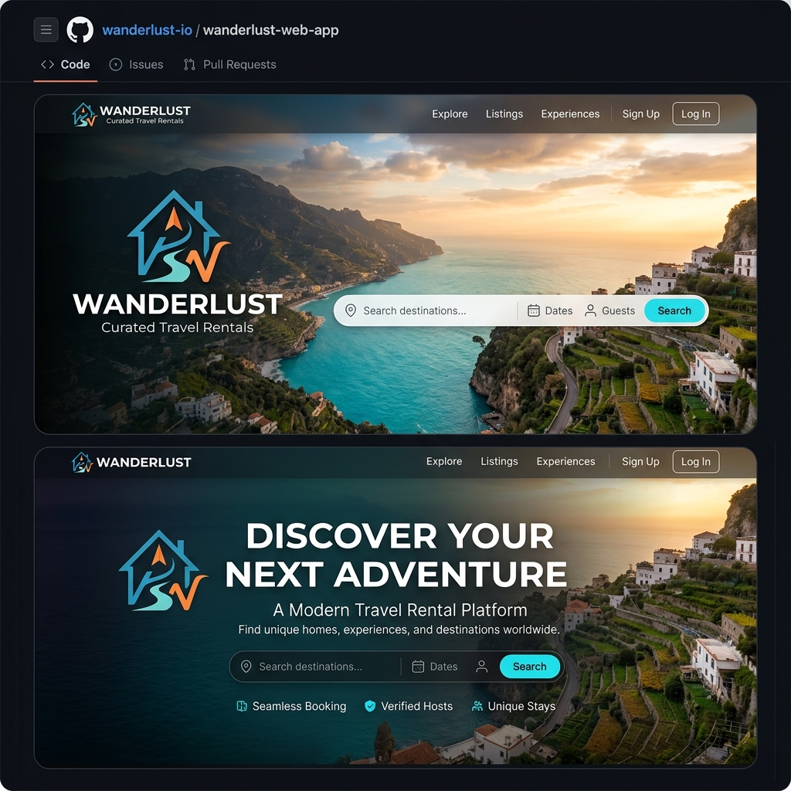
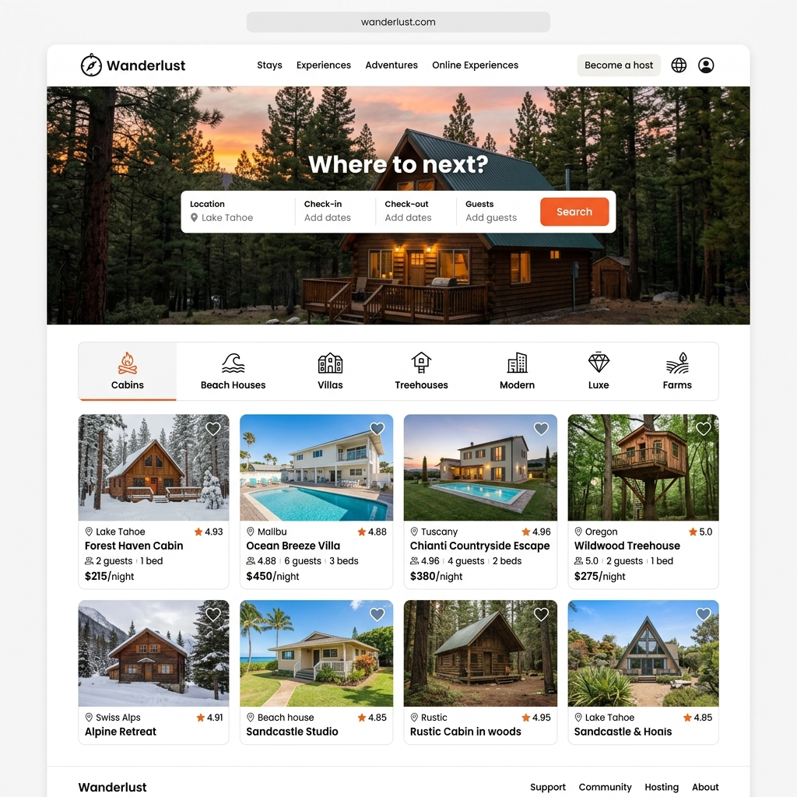
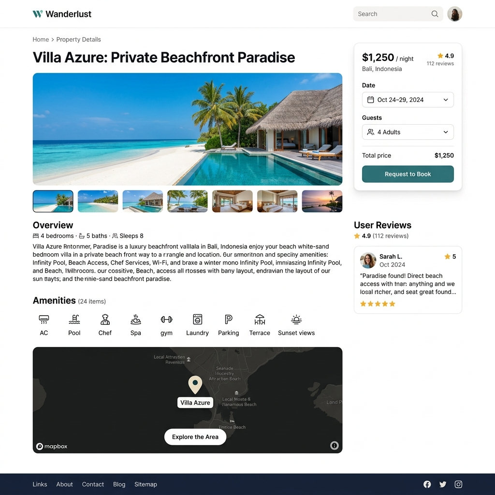
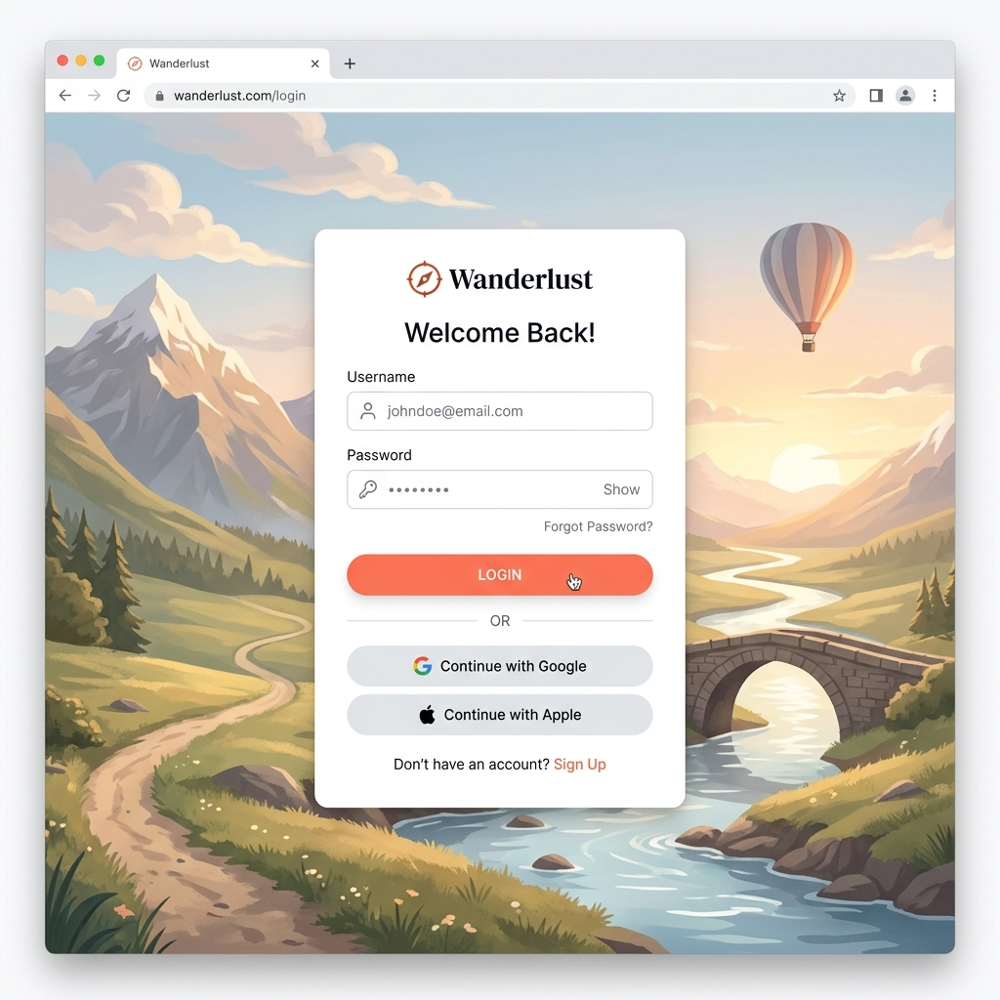
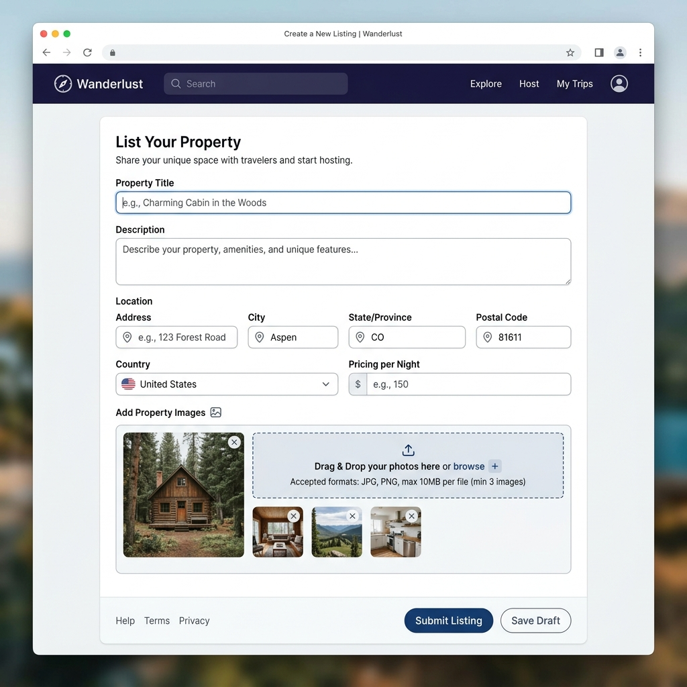

<div align="center">
  

  # 🏡 Wanderlust (Airbnb Clone)
  
  **Wanderlust** is a robust, full-stack MVC web application modeled after Airbnb. It empowers travelers to explore unique vacation rentals, make informed decisions via a review system, and visualize listing locations interactively. Simultaneously, it allows property hosts to list, update, and manage their listings with ease.
  
  ---
  
  [](https://nodejs.org/)
  [](https://expressjs.com/)
  [](https://www.mongodb.com/)
  [](https://www.mapbox.com/)
  [](https://cloudinary.com/)
  [](https://opensource.org/licenses/ISC)
  
  **[🌐 Live Application Link](https://wanderlust-4c1x.onrender.com/listings)**
</div>

## 📌 Project Overview

**Wanderlust** is a production-ready vacation rental platform designed to showcase the implementation of modern MVC architecture, robust security authentication, and dynamic media handling on the web. The application serves two primary user roles:
*   **Travelers** who can seamlessly search for rental listings across different categories, inspect listing locations, and review their experiences.
*   **Property Hosts** who can create, edit, update, and delete their own rental listings, managing pricing, descriptions, and media assets.

The application relies on secure server-side validations, session persistency, and cloud services for an optimal, low-latency client experience.

---

## ✨ Features

*   **🔒 Secure User Authentication**: Full user signup, login, and logout capabilities powered by passport-local-mongoose, persisting active sessions securely.
*   **🏠 Listing Management (CRUD)**: Authorized hosts can create, edit, and delete properties while travelers browse properties seamlessly.
*   **☁️ Cloudinary Image Upload**: Seamless integration for image uploads using Multer and Multer Storage Cloudinary, including image manipulation/transformation on updates.
*   **⭐ Property Reviews & Star Ratings**: Interactive review submission with rating levels (1-5 stars) using EJS-compatible star styling.
*   **🗺️ Interactive Mapbox Maps**: Dynamic location visualization using Mapbox SDK, pinning properties on visual maps.
*   **📦 Session Persistence**: Sessions are saved inside a MongoDB database (via Connect Mongo store) so users remain signed in across server recycles.
*   **🛡️ Authorization & Ownership Gates**: Strict server-side route guards ensuring users can only modify/delete their own listings and reviews.
*   **📱 Responsive & Fluid Design**: Modern interface crafted with Bootstrap, custom media queries, and FontAwesome icons that render beautifully on mobile, tablet, and desktop viewports.

---

## 📸 Screenshots

### Home Page
Displays the curated vacation listings inside a modern grid format along with Category filter chips and search functionality.


### Listing Details
Shows complete listing content, including amenities, reviews, host information, booking widget, and interactive Mapbox map.


### Login Page
Clean, centralized user portal for authentication, designed with micro-interactions and strict flash validation messages.


### Create Listing
A structured property registration form with title, price, location, description inputs, and a custom image upload block.


---

## 🛠️ Tech Stack

### Backend & Core
*   **Node.js**: Asynchronous event-driven JavaScript runtime environment.
*   **Express.js**: Fast, minimalist web framework handling REST endpoints and middleware flow.
*   **EJS & EJS-Mate**: Templating engine and layouts to construct dry, modular views.
*   **Joi**: Schema-based validation tool for client-submitted HTTP request data.

### Database & Security
*   **MongoDB Atlas**: Distributed cloud database to store user records, listings, and reviews.
*   **Mongoose**: ODM library modeling MongoDB structures and handling schema relationships.
*   **Passport.js**: Multi-strategy authentication middleware.
*   **Connect Mongo & Express Session**: State persistence handling session credentials in a Mongo database.

### Third-Party APIs
*   **Cloudinary**: Media server for high-performance image uploads, storage, and optimization.
*   **Mapbox API**: Interactive geographical visualization library.

---

## 🗂️ Folder Structure

The project follows a standard **Model-View-Controller (MVC)** design pattern to keep the routing, logic, and presentation layers highly decoupled and clean.

```
wanderlust/
├── controllers/          # Controllers handling route handler business logic
│   ├── listings.js       # Listing CRUD operations & query search filters
│   ├── review.js         # Review creation & deletion logic
│   └── user.js           # User registration, login & session logout handlers
├── models/               # Mongoose schemas representing database collections
│   ├── listing.js        # Listings data model & cascade hooks
│   ├── review.js         # Reviews data model containing comments and ratings
│   └── user.js           # Users data model integrated with passport plugins
├── routes/               # Express Router handlers dividing logical scopes
│   ├── listing.js        # Listing resource endpoints
│   ├── review.js         # Nested reviews endpoints
│   └── user.js           # User identity & authentication endpoints
├── views/                # Frontend Embedded JavaScript (EJS) files
│   ├── layouts/          # Reusable layouts (boilerplate.ejs)
│   ├── includes/         # Partials (navbar, footer, flash alerts)
│   ├── listings/         # Listing views (index, show, edit, new)
│   └── users/            # Authentication views (login, signup)
├── public/               # Client-side static resources
│   ├── css/              # Stylesheets for layouts and interactive components
│   └── js/               # Client scripts (Mapbox initialization, validation)
├── utils/                # Utility helpers for error handling
│   ├── ExpressError.js   # Custom Error class mapping statusCodes and messages
│   └── wrapAsync.js      # Wrapper handling uncaught asynchronous error promises
├── init/                 # Seeding scripts to clean and seed data
│   ├── data.js           # Seed listing datasets
│   └── index.js          # Database seed executor
├── cloudConfig.js        # Cloudinary setup and storage engine configurations
├── middleware.js         # Route guard functions (Authorization & Validation)
├── schema.js             # Joi validation schemas for listings and reviews
├── app.js                # Server entry file orchestrating configurations
└── package.json          # Node dependencies and project scripts
```

---

## ⚙️ Environment Variables

Before launching the server, copy `.env.example` to a new `.env` file in the root directory:

```bash
cp .env.example .env
```

Define the following credentials inside the `.env` file:

```env
# Database Connections
MONGO_URL=mongodb+srv://<username>:<password>@cluster0.mongodb.net/wanderlust?retryWrites=true&w=majority

# Session & Security Credentials
SECRET=your_long_secure_session_secret_key

# Cloudinary Integration API Keys
CLOUD_NAME=your_cloudinary_cloud_name
CLOUD_API_KEY=your_cloudinary_api_key
CLOUD_API_SECRET=your_cloudinary_api_secret

# Mapbox Map Integration Keys
MAP_TOKEN=your_mapbox_public_access_token

# Environment Configuration
NODE_ENV=development
PORT=3000
```

---

## 🚀 Installation Guide

### Prerequisites
Make sure you have [Node.js](https://nodejs.org/) (v22.17.1 or higher) and [MongoDB](https://www.mongodb.com/try/download/community) installed locally, or utilize MongoDB Atlas.

### Step-by-Step Installation
1.  **Clone the Repository**:
    ```bash
    git clone https://github.com/Sanesh764/wanderlust.git
    cd wanderlust
    ```

2.  **Install Dependencies**:
    ```bash
    npm install
    ```

3.  **Configure Environment Variables**:
    Create a `.env` file in the root folder according to the [Environment Variables](#%EF%B8%8F-environment-variables) section.

4.  **Seed the Database** (Optional):
    Populate your local or remote database with mock vacation rental listings:
    ```bash
    node init/index.js
    ```

5.  **Run the Server**:
    Start the application with nodemon (development mode):
    ```bash
    npm run dev
    ```
    Or run normally:
    ```bash
    node app.js
    ```

6.  **Access the Application**:
    Open [http://localhost:3000](http://localhost:3000) in your web browser.

---

## 📖 Usage Instructions

### For Vacation Travelers
1.  **Explore Rentals**: Browse properties using Category filters (e.g. pool, cabin, beach, camping, farm) or utilize the search bar to locate listings matching specific titles or locations.
2.  **View Listings**: Tap on a listing card to view its description, pricing per night, host details, amenities list, location on Mapbox, and other traveler reviews.
3.  **Sign Up & Sign In**: Access full features by creating a new account.
4.  **Submit Reviews**: Write review comments and select star ratings. You can also delete reviews you authored.

### For Property Owners / Hosts
1.  **Create a Listing**: Navigate to the "Wanderlust Your Home" portal, input listing properties, upload a property banner photo, and post the listing.
2.  **Edit / Manage Listings**: Open your listing to find operational links. Update details, swap pictures, or adjust price options.
3.  **Delete Listings**: Permanently clear listings from the database. All related review records will be swept automatically from the collections.

---

## 🔒 Authentication Flow

Wanderlust leverages a session-based state management framework backed by Passport.js:

```
[User Form Login] 
       │
       ▼
[passport-local Strategy] ──► (Validates Username/Hash/Salt in models/user.js)
       │
       ├─► Success: serializes User ID to session ──► stores session in Connect Mongo
       │
       └─► Failure: Triggers failureFlash ──► redirects user to /login
```

*   **Model Level**: The user model [user.js](file:///C:/Users/ASUS/OneDrive/Documents/Desktop/project_web%20dev/wanderlust/models/user.js) utilizes the `passport-local-mongoose` plugin, which automatically handles username hashing and salt generation.
*   **Session Guard Middleware**: 
    *   The `isLoggedIn` middleware in [middleware.js](file:///C:/Users/ASUS/OneDrive/Documents/Desktop/project_web%20dev/wanderlust/middleware.js) intercepts incoming requests, routing unauthenticated traffic to `/login` while storing their destination path inside `req.session.redirectUrl`.
    *   A secondary custom middleware `saveRedirectUrl` copies the path to `res.locals.redirectUrl` right before passport processes the login event (preventing passport from cleaning the session object).
*   **Session Security Configuration**: Session cookies are configured with the `httpOnly: true` flag to prevent scripting exploits and expire after 7 days to maintain secure user state.

---

## 🏠 Listing Management Features

The listing features handle complete CRUD capability inside [listings.js](file:///C:/Users/ASUS/OneDrive/Documents/Desktop/project_web%20dev/wanderlust/controllers/listings.js):

*   **Strong Server-Side Validations**: Before listing documents reach MongoDB, they are routed through the `validateListing` middleware which runs validations against the Joi schema in [schema.js](file:///C:/Users/ASUS/OneDrive/Documents/Desktop/project_web%20dev/wanderlust/schema.js).
*   **Data Models**: Listing properties are structured with references in [listing.js](file:///C:/Users/ASUS/OneDrive/Documents/Desktop/project_web%20dev/wanderlust/models/listing.js), binding the creator ID (`owner`) and reviews list (`reviews`).
*   **Strict Access Control**: Route endpoints like `PUT /listings/:id` and `DELETE /listings/:id` check request legitimacy using the `isOwner` middleware:
    ```javascript
    if (!res.locals.currUser || !listing.owner.equals(res.locals.currUser._id)) {
        req.flash("error", "You do not have permission to modify this listing.");
        return res.redirect(`/listings/${id}`);
    }
    ```

---

## ⭐ Review System Features

Wanderlust features an interactive customer feedback system inside [review.js](file:///C:/Users/ASUS/OneDrive/Documents/Desktop/project_web%20dev/wanderlust/controllers/review.js):

*   **Database Schema**: Reviews are stored in a dedicated `Review` collection mapped to listings. Each review records the author's reference ID, feedback comment text, a numeric star rating, and timestamp.
*   **Starability Interface**: Uses CSS-only star layout sheets inside EJS templates ([show.ejs](file:///C:/Users/ASUS/OneDrive/Documents/Desktop/project_web%20dev/wanderlust/views/listings/show.ejs)) to let users submit ratings without needing bulky Javascript files.
*   **Cascade Delete Mechanism**: To clean up unused reviews when a listing is deleted, a Mongoose post-hook triggers on listing schema:
    ```javascript
    listingSchema.post("findOneAndDelete", async (doc) => {
      if (doc) {
        await Review.deleteMany({ _id: { $in: doc.reviews } });
      }
    });
    ```
*   **Review Deletion Checks**: The custom middleware `isReviewAuthor` checks if the current user is the original creator of the review before executing database deletions.

---

## 🗺️ Map Integration

Geographical mapping is handled dynamically via Mapbox GL JS inside EJS:

*   **Client-Side Map Loading**: In [show.ejs](file:///C:/Users/ASUS/OneDrive/Documents/Desktop/project_web%20dev/wanderlust/views/listings/show.ejs), the server-side environment Mapbox token is initialized onto the page.
*   **Coordinates Render**: In [map.js](file:///C:/Users/ASUS/OneDrive/Documents/Desktop/project_web%20dev/wanderlust/public/js/map.js), the Mapbox SDK initiates maps, placing markers and configuring coordinate bounds.
*   **Interactive Viewports**: Standard pan, zoom, and pitch controls are set up on the location division widget.

---

## ☁️ Cloudinary Integration

Wanderlust uses a cloud media pipeline to manage image assets seamlessly:

*   **Multer Integration**: Incoming property files are intercepted by the Multer parser in [routes/listing.js](file:///C:/Users/ASUS/OneDrive/Documents/Desktop/project_web%20dev/wanderlust/routes/listing.js).
*   **Direct Cloud Stream**: Rather than writing files to local disk, the storage engine defined in [cloudConfig.js](file:///C:/Users/ASUS/OneDrive/Documents/Desktop/project_web%20dev/wanderlust/cloudConfig.js) streams images directly to Cloudinary, saving them under the `wanderlust_dev` directory.
*   **Image Transformations**: To optimize bandwidth when loading edit forms, image links are transformed dynamically:
    ```javascript
    let originalImageUrl = listing.image.url;
    originalImageUrl = originalImageUrl.replace("/upload", "/upload/w_250");
    ```
    This serves a 250px wide thumbnail version on edit screens.

---

## 🔮 Future Improvements

- [ ] **Wishlist Module**: Enable users to save listings into their favorites lists.
- [ ] **Booking Calendar**: Add an interactive scheduling system preventing double-booking.
- [ ] **Stripe Payment Integration**: Secure credit card transactions for rental reservations.
- [ ] **User Profiles**: Enhanced profiles showing listed properties and previous ratings.
- [ ] **Advanced Search & Filtering**: Filter listings by guest count, bedrooms, and price range.
- [ ] **Dynamic Geocoding**: Automatically extract coordinates using Mapbox Geocoding API based on string inputs.
- [ ] **Push & Email Notifications**: Notify users on reservation status updates or new reviews.
- [ ] **Dark Mode Toggle**: Sleek visual mode option for nocturnal travelers.

---

## 🧗 Challenges Faced

### 1. Multer Request-Parsing Order
*   **Problem**: Joi validation middleware failed because the request body was initially blank. Express parsers could not read multipart forms.
*   **Solution**: Re-routed route parameters inside [routes/listing.js](file:///C:/Users/ASUS/OneDrive/Documents/Desktop/project_web%20dev/wanderlust/routes/listing.js), placing Multer `upload.single(...)` prior to Joi `validateListing` validation middleware.

### 2. Session ID Regeneration Wipes Redirect Data
*   **Problem**: When authenticating user logins, Passport.js regenerates the session ID. This action cleared custom redirect parameters stored in `req.session`.
*   **Solution**: Implemented a custom middleware `saveRedirectUrl` that pulls the redirect URI from the session store and copies it to `res.locals.redirectUrl` right before the Passport verification strategy executes.

### 3. Orphanned Database Documents on Deletes
*   **Problem**: Deleting listing documents left their associated review records in the database, wasting space.
*   **Solution**: Created a Mongoose post-query middleware hook (`findOneAndDelete`) on the listing model that catches the listing and deletes any review IDs stored in the list.

### 4. Client-side Mapbox Script Token Exposure
*   **Problem**: Referencing server-side variables directly inside client-side JS files is not supported by standard browser execution.
*   **Solution**: Initialized the map token onto a global scope variable within EJS tags, and then loaded the static script file `map.js` which references that global variable securely.

---

## 🧠 Learning Outcomes

*   **MVC System Architecture**: Mastered project structures by separating controllers, routers, database schemas, views, and custom middleware.
*   **State Management & Cookies**: Gained insights into sessions, cookie management, flash messaging systems, and user authentication pipelines.
*   **Schema Defense Mechanisms**: Built robust server validation layers using Joi schemas.
*   **Cloud Operations**: Designed custom storage pipelines using Multer, Cloudinary, and Mapbox geolocation elements.
*   **Database Relationships**: Modeled schema collections and handled database cascading operations.

---

## 👨‍💻 Author Information

| Profile | Details |
| :--- | :--- |
| **Name** | Sanesh Kumar |
| **Role** | Computer Science Engineering Student |
| **Skills** | C++ • JavaScript • Node.js • Express.js • MongoDB • Data Structures & Algorithms |
| **GitHub** | [@Sanesh764](https://github.com/Sanesh764) |
| **Portfolio Project** | [Wanderlust Repository](https://github.com/Sanesh764/wanderlust) |

---

## 📄 License

This project is licensed under the terms of the **ISC License**. Feel free to use, modify, and distribute this codebase for personal and commercial projects.
